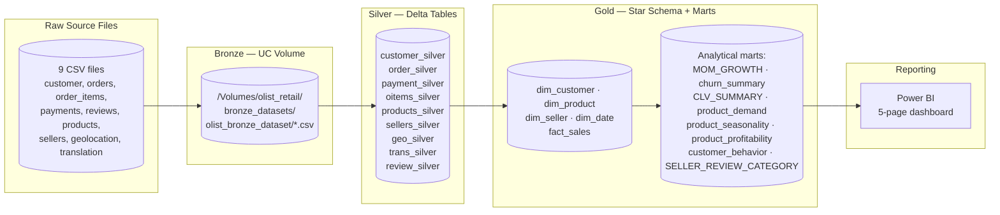
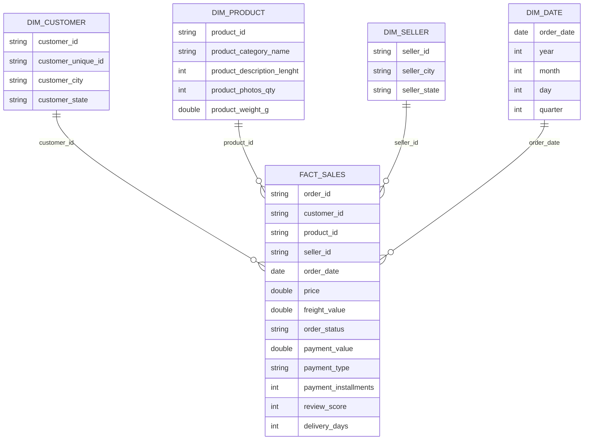

# Olist_Retail_DA_Project
Designed and implemented a modern retail analytics workflow covering data ingestion, transformation, KPI development, and dashboard reporting to support data-driven decision-making for e-commerce operations.

# Olist Brazilian E-Commerce Analytics — Databricks + SQL + Power BI

End-to-end retail analytics project built on the Olist Brazilian e-commerce dataset. I took raw transactional data through a full medallion pipeline in Databricks — profiling and cleaning nine source files, modeling them into a star schema, writing gold-layer SQL to answer real revenue/customer/product/seller questions — and closed the loop with a five-page Power BI dashboard that a business stakeholder could actually use to make decisions.

The goal wasn't to build another "clean CSV + bar chart" project. It was to simulate what a BI/analytics engineer actually does at a retail or fintech company: take messy multi-table transactional data, decide what's *actually* wrong with it, build a model that survives repeat use, and ship reporting that answers specific business questions instead of just describing the data.

**Stack:** Databricks (Unity Catalog, PySpark, Delta Lake) → Spark SQL (Gold layer + analysis) → Power BI

---

## Business Problem

Olist is a Brazilian marketplace that connects small sellers to major e-commerce channels. The raw data — customers, orders, order items, payments, products, sellers, reviews, and geolocation — arrives as nine disconnected CSV extracts. On their own they can't answer the questions that actually matter to the business:

- Where is revenue growing or shrinking, month over month?
- Which product categories and states drive the business, and which are dead weight?
- How much of the customer base is repeat business versus one-time buyers, and how much of it has effectively churned?
- Which sellers are reliable (fast delivery, good reviews) versus a liability?
- Is delivery speed actually costing the business in review scores and repeat orders?

Answering these requires joining nine tables correctly, handling the missing/inconsistent data each one carries, and organizing everything into a model that's fast and unambiguous to query — which is exactly what this project builds.

---

## Dataset Overview

The dataset is the public Olist Brazilian E-Commerce dataset, ingested as nine raw CSV files into a Databricks Unity Catalog Volume before any transformation:

| Source file | Grain | Role |
|---|---|---|
| `customer.csv` | one row per customer record | customer identity + location |
| `orders.csv` | one row per order | order lifecycle timestamps + status |
| `order_items.csv` | one row per item within an order | price, freight, seller, shipping deadline |
| `order_payments.csv` | one row per payment transaction | payment type, installments, value |
| `order_review.csv` | one row per review | review score |
| `products.csv` | one row per product | category, weight, photo count |
| `sellers.csv` | one row per seller | seller location |
| `geolocation.csv` | one row per zip-code/lat-long pair | geographic lookup |
| `product_category_name_translation.csv` | one row per category | PT → EN category translation |

After modeling, the grain of the analytical fact table is **one row per order item** — the finest grain available, since a single order can contain items from multiple sellers and categories. Per the final Power BI model, this resolves to **118.3K fact rows across ~95.4K unique customers, ~20.4M BRL in total revenue, and an average order value of ~207 BRL.**

---

## Technology Stack

| Tool | How it was used |
|---|---|
| **Databricks (Unity Catalog)** | Central platform for the whole pipeline — raw file storage in a UC Volume, Delta table management, and SQL execution across catalog `olist_retail` |
| **PySpark / pandas** | Each source file was profiled and cleaned in pandas first (structure checks, null/duplicate detection, type coercion), then converted with `spark.createDataFrame()` and written out as managed Delta tables — a deliberate choice to get pandas' faster, more readable profiling tools on datasets small enough to fit in memory, while still landing everything as governed Delta tables for downstream SQL |
| **Delta Lake** | Storage format for every Silver and Gold table — gives ACID writes and lets me safely `overwrite` tables while iterating on transformation logic |
| **Spark SQL** | All dimensional modeling, the fact table build, and every analytical query — window functions (`ROW_NUMBER`, `LAG`), date functions (`DATEDIFF`, `DATE_FORMAT`, `QUARTER`), and CTEs throughout |
| **Power BI** | Reporting layer — five report pages connected to the Gold schema, covering executive KPIs, revenue, customers, products, and sellers |
| **GitHub** | Version control for notebooks, SQL scripts, and the exported dashboard |

---

## Solution Architecture



- **Data flow:** raw CSVs land untouched in a Unity Catalog Volume (Bronze), get profiled and cleaned in pandas/PySpark and written as Delta tables (Silver), then get reshaped into a conformed star schema plus a set of purpose-built analytical marts (Gold).
- **Processing layer:** all cleaning logic lives in the `Data Cleaning & Preparation` notebook, one section per source table.
- **Analytics layer:** the star schema and every downstream mart are built entirely in Spark SQL against the Silver tables.
- **Reporting layer:** Power BI connects to the Gold schema and reads directly from `fact_sales`, the dimension tables, and the marts — no additional transformation happens inside the report itself.

---

## Medallion Architecture

### Bronze Layer

The nine raw Olist CSVs are landed as-is into a Unity Catalog Volume at `/Volumes/olist_retail/bronze_datasets/olist_bronze_dataset/`, with no schema enforcement or transformation applied. This is a deliberate boundary: Bronze exists purely to preserve an unmodified copy of what the source system handed over, so any downstream cleaning decision can always be traced back to and re-validated against the original file.

### Silver Layer

Each of the nine files gets its own profiling-and-cleaning pass, structured consistently across every table:

1. **Structure assessment** — shape, column list, dtypes
2. **Missing value audit** — both raw counts and missing-percentage, so a null rate gets read in context rather than in isolation
3. **Duplicate detection** — full-row duplicates, plus targeted checks on the natural key (e.g., duplicate `order_id`)
4. **Type correction** — every timestamp column in `orders.csv` (`order_purchase_timestamp`, `order_approved_at`, `order_delivered_carrier_date`, `order_delivered_customer_date`, `order_estimated_delivery_date`) gets coerced from string to `datetime` with `errors='coerce'`, so malformed timestamps become nulls instead of silently breaking later date math
5. **Business-rule validation** — rather than blindly dropping every null, I cross-tabbed null timestamps against `order_status`. For example, orders missing `order_approved_at` or `order_delivered_carrier_date` were checked against how many of those were *also* marked `delivered` — because a null carrier-handoff date on a `delivered` order is a genuine data quality exception, not an expected gap tied to a cancelled or unavailable order. One such row (a `delivered` order with a null carrier date) was removed outright as an unresolvable exception.
6. **Category standardization** — `products.csv` rows missing `product_category_name` were filled with `"Unknown"` rather than dropped, since these were still real, revenue-generating transactions.

Every cleaned table is written to `Olist_Retail.Silver_Datasets` as a managed Delta table (`customer_silver`, `order_silver`, `payment_silver`, `oitems_silver`, `products_silver`, `sellers_silver`, `geo_silver`, `trans_silver`, `review_silver`), each preceded by an explicit `DROP TABLE IF EXISTS` to keep reruns idempotent.

### Gold Layer

The Gold layer is where the Silver tables get reshaped from "one table per source file" into "tables built for how the business asks questions." It has two parts:

- **A conformed star schema** (dimensions + one fact table) that any new SQL question can be run against directly
- **A set of pre-aggregated analytical marts**, each one built to answer a specific recurring business question (growth, churn, CLV, seasonality, profitability) without re-deriving the same logic every time

---

## Data Modeling

The model is a straightforward star schema: a single grain-level fact table joined to four dimensions, all built with plain `CREATE OR REPLACE TABLE ... AS SELECT` statements against the Silver layer.



**Design decisions:**

- **Grain:** `fact_sales` is built by starting from `oitems_silver` (order items) rather than `order_silver` (orders), because item-level is the finest grain that still ties cleanly to price, freight, product, and seller. An order-level fact would have forced an arbitrary rule for splitting payment and freight across items.
- **`fact_sales` is assembled with four LEFT JOINs** — orders, customers, payments, and reviews — off the order-items base, so an order item is never dropped just because it's missing a review or a matched payment record.
- **`delivery_days`** is a derived fact column (`DATEDIFF(delivered_customer_date, purchase_timestamp)`), computed once in the fact table build rather than recalculated in every downstream query.
- **Dimensions are intentionally narrow.** `dim_product`, for instance, only carries category, description length, photo count, and weight — not every column from `products_silver` — because those are the only product attributes the analysis layer actually uses. This keeps the dimension tables cheap to join.
- **`dim_date` is generated as `SELECT DISTINCT`** off the order timestamp rather than a pre-built calendar table, since the analysis only ever needs dates that appear in real orders.

---

## SQL Business Analysis

All analysis SQL runs against the Gold schema (`fact_sales` + dimensions). The project covers 20+ distinct business questions across four notebooks/scripts:

### Revenue Analysis
| Question | Approach |
|---|---|
| Monthly revenue trend | `date_format(order_date,'yyyy-MM')` grouped sum of `payment_value`, with a companion **MoM growth mart** that uses `LAG()` to compute month-over-month revenue delta |
| Top product categories by revenue | Join to `dim_product`, sum `payment_value`, `LIMIT 10` |
| Revenue by state | Join to `dim_customer`, sum `payment_value` by `customer_state` |
| Payment type influence | Grouped sum + order count by `payment_type`, to see how credit card vs. boleto usage splits revenue |
| Freight cost analysis | Freight as a % of revenue, by product category — flags categories where shipping cost is eating disproportionately into order value |

### Customer Analysis
| Question | Approach |
|---|---|
| Customer distribution by city | `COUNT(DISTINCT customer_unique_id)` per city, with `% share` computed via a window function (`SUM(...) OVER()`) |
| New vs. repeat customers | `customer_behavior` mart: a single `CASE` on order count per `customer_unique_id` (`1 = New`, `>1 = Repeat`) |
| Customer churn | `churn_summary` mart: recency in days since each customer's last order (`DATEDIFF` against the dataset's max order date), bucketed into **Active (≤30 days) / At Risk (≤90 days) / Churned (>90 days)** |
| Customer lifetime value | `CLV_SUMMARY` mart: total orders, total revenue, and average order value per customer, bucketed into **Low / Medium / High value** tiers by cumulative revenue |
| Top customers by revenue | Ranked list of customers by total `payment_value`, joined with average review score to see whether top spenders are also satisfied customers |
| CLTV & repeat rate by state | Orders-per-customer ratio at the state level, to see where loyalty is strongest geographically |

### Product & Seller Analysis
| Question | Approach |
|---|---|
| Top 3 categories per state | `ROW_NUMBER() OVER (PARTITION BY state ORDER BY revenue DESC)`, filtered to `rn <= 3` — a per-state leaderboard in one query |
| Product demand | Orders and revenue per `product_id` |
| Product churn (recency) | Days since each product's last recorded sale |
| Product seasonality | Orders and revenue per product, split by calendar month |
| Product profitability | `payment_value - price` as a proxy profit measure, aggregated per product |
| Product pricing / freight ratio | Average price vs. average freight vs. average total payment per category, to spot categories where freight overwhelms product price |
| Seller performance & efficiency | Revenue, order count, and average review score per seller, filtered to sellers with ≥10 orders to avoid noise from low-volume sellers |
| Seller review categorization | `SELLER_REVIEW_CATEGORY_TABLE`: average review score per seller bucketed into **Excellent (≥4.5) / Good (≥4.0) / Average (≥3.0) / Poor (<3.0)** |
| Delivery performance by state | Average/min/max delivery days by customer state, joined against average review score |
| Delivery speed vs. satisfaction | Orders bucketed into delivery windows (1–7 / 8–14 / 15–21 / 22+ days), each compared against average review score and order value — this is the query that actually tests whether "faster delivery = happier customer" holds in the data |

---

## Analytics Data Marts

These are the Gold-layer tables built specifically to be queried directly by Power BI or ad-hoc analysis, rather than re-deriving the logic every time:

| Mart | Grain | Purpose |
|---|---|---|
| `MOM_GROWTH` | one row per month | Month-over-month revenue and revenue delta |
| `CUSTOMER_COUNT_DISTRIBUTION` | one row per city | Customer count and % share by city |
| `churn_summary` | one row per customer | Recency + churn status (Active / At Risk / Churned) |
| `CLV_SUMMARY` | one row per customer | Total orders, total revenue, AOV, value tier |
| `customer_behavior` | one row per customer | New vs. Repeat classification |
| `top_3_products_in_state` | one row per state × top-3 category | Per-state category leaderboard |
| `product_demand` | one row per product | Orders and revenue per product |
| `product_churn` | one row per product | Days since last sale |
| `product_seasonality` | one row per product × month | Monthly order/revenue pattern per product |
| `product_profitability` | one row per product | Price, revenue, and profit per product |
| `SELLER_REVIEW_CATEGORY_TABLE` | one row per seller | Average review score + qualitative rating bucket |

---

## Power BI Dashboard

The dashboard is a five-page report exported as `olist_retail_powerbi_dashboard.pdf`, built directly off the Gold schema.

### Executive Overview
KPI strip: **Total Revenue 20.42M · Total Orders 118.3K · Unique Customers 98.66K · AOV 206.93 · Total Freight 2.37M · Avg. Review 4.03.** Below the KPIs: a monthly revenue trend line, a top-10 selling region chart (by seller state), and a top-20 product category ranking. Two supporting breakdowns — payment type and order status — show credit card as the dominant payment method (roughly three-quarters of transactions, with boleto a distant second) and over 97% of orders landing in `delivered` status, with only a small residual share cancelled or otherwise unresolved. A year slicer lets the whole page be filtered down to a single year.

### Customer Analysis
KPIs: **Total Customers 95.418K · Average Order Value $172.57 · Purchase Frequency 1.24 · Churn Rate 81.20%.** The core story on this page is repeat-purchase weakness: the New vs. Repeat breakdown shows **~97% of customers are one-time buyers**, and the churn donut confirms it — matching the 81.2% churn KPI directly, with the remainder split across At Risk and Active. A three-year MoM growth chart and a top-20-customers-by-sales ranking round out the page, along with a customer-value tier breakdown (Low / Medium / High) built on the CLV mart.

### Revenue Analysis
Repeats the core KPIs (Total Revenue, Total Orders, AOV) with a state-level lens: **São Paulo alone accounts for roughly 7.6M of the 20.42M total revenue** — by far the largest single state — followed by Rio de Janeiro, Minas Gerais, and Rio Grande do Sul at a fraction of that. A monthly growth chart broken out by year (2016/2017/2018) shows the business's revenue ramp, and a revenue-by-category breakdown (furniture, beauty, sports, tools, electronics, etc.) shows how concentrated revenue is in a handful of categories versus a long tail of niche ones. A three-year revenue split shows **2018 alone contributing over three-quarters of total revenue**, consistent with Olist's actual growth trajectory as a marketplace.

### Product Analysis
KPIs: **Total Revenue 20.42M · Products Cost 14.27M · Total Profit 6.14M** — roughly a 30% margin at the product level. Revenue-by-category confirms the same top categories seen on the Revenue page. The product churn visual (days since last order) is notably flat across almost every product — nearly all cluster around ~700 days — which reflects the dataset's fixed historical window (it ends at a set point in time) more than any real demand signal; I called this out explicitly rather than overselling it as a differentiating churn metric. The page also breaks down top-3 selling products by top region, monthly revenue trend per product, order frequency leaders, most-profitable products, and — deliberately included — the **lowest-revenue categories** (insurance/services, men's fashion, CDs/DVDs, PC gaming, flowers, arts & crafts), which is just as useful for a merchandising conversation as knowing the winners.

### Seller Analysis
KPIs: **Total Sellers 3.095K · Average Delivery ~12 days · Average Review 4.03.** Seller concentration mirrors the customer/revenue geography: **nearly 60% of all sellers are based in São Paulo**, with Paraná, Minas Gerais, and Santa Catarina making up most of the rest. The seller-review categorization (built from `SELLER_REVIEW_CATEGORY_TABLE`) shows the majority of sellers rated Good or Excellent, with a smaller share landing in Average or Poor. Top-sellers-by-revenue and top-sellers-by-order-count rankings, plus a delivery-performance view and a year-over-year seller growth chart, complete the page.

---

## Core Measures

The KPI cards across the dashboard are driven by measures aggregating directly off `fact_sales` and the marts — logically equivalent to:

```DAX
Total Revenue = SUM(fact_sales[payment_value])
Total Orders = DISTINCTCOUNT(fact_sales[order_id])
Average Order Value = DIVIDE([Total Revenue], [Total Orders])
Total Customers = DISTINCTCOUNT(fact_sales[customer_unique_id])
Purchase Frequency = DIVIDE([Total Orders], [Total Customers])
Average Review Score = AVERAGE(fact_sales[review_score])
Churn Rate = DIVIDE(CALCULATE(COUNTROWS(churn_summary), churn_summary[churn_status] = "Churned"), COUNTROWS(churn_summary))
Total Profit = SUM(product_profitability[profit])
```

Each of these mirrors an aggregation already proven out in the corresponding gold-layer SQL mart, so the dashboard numbers and the SQL analysis numbers agree by construction rather than by coincidence.

---

## Key Business Insights

- **Revenue is heavily geography-concentrated.** São Paulo alone drives more revenue than the next several states combined, which has direct implications for where logistics investment or seller recruitment should focus next.
- **Repeat purchasing is the biggest weakness in the business, not acquisition.** With ~97% of customers buying exactly once and an 81% churn rate, growth is being carried almost entirely by new-customer acquisition — a retention program would likely move the needle more than further top-of-funnel spend.
- **2018 alone accounts for the large majority of total revenue** in the three-year window, showing rapid platform growth rather than a mature, flat business.
- **Product profitability is healthy in aggregate (~30% margin)** but heavily concentrated in a small set of categories, with a long tail of near-zero-revenue categories that may not be worth the catalog overhead.
- **Delivery speed and review score move together** — the delivery-bucket analysis (1–7 / 8–14 / 15–21 / 22+ days) exists specifically to quantify this relationship rather than assume it.
- **Seller supply mirrors customer/revenue geography almost exactly** — São Paulo dominates seller count the same way it dominates revenue, suggesting the platform's growth is regionally self-reinforcing rather than balanced nationally.

---

## Challenges Encountered

- **Distinguishing expected nulls from real data quality problems.** A null `order_delivered_carrier_date` is normal for a cancelled order, but is a genuine defect on a `delivered` order. I handled this by cross-tabbing nulls against `order_status` before deciding whether to drop, flag, or leave a row — rather than applying a blanket null-handling rule across the whole table.
- **Choosing the fact grain.** Building `fact_sales` off order items instead of orders meant every downstream query (revenue, freight, seller performance) had a clean, unambiguous grain — but it also meant order-level metrics (like `order_status`) had to be carried through the join rather than looked up separately.
- **Multiple LEFT JOINs on the fact build.** Because payments and reviews aren't guaranteed to exist for every order item, I had to use LEFT JOINs throughout `fact_sales` rather than INNER JOINs, to avoid silently dropping legitimate order items that happen to be missing a review.
- **A flat "days since last order" signal on products.** The product churn mart technically works, but because the dataset has a fixed end date, almost every product shows a similar recency value — a real limitation worth acknowledging rather than presenting as more insightful than it is.

---

## Learnings and Takeaways

This project pushed me past "write a query that returns the right numbers" into actually thinking about *why* a table should be shaped a certain way. Deciding to build `fact_sales` at the order-item grain instead of the order grain, and having to justify that decision against how freight and payment data actually behave, taught me more about dimensional modeling than any tutorial had up to that point.

The null-handling work on the `orders` table was the part that shifted how I think about data cleaning generally — instead of asking "how do I remove nulls," I started asking "what does this null *mean* for this specific business status," which is a much more useful question in a real analytics job.

On the SQL side, this was my first real use of window functions in a business context — `ROW_NUMBER() OVER (PARTITION BY ...)` for the per-state top-3 leaderboard, and `LAG()` for month-over-month growth, both patterns I now reach for automatically instead of solving the same problem with self-joins.

Building the Power BI layer last, after the marts already existed, also reinforced a lesson about report design: because the churn, CLV, and profitability logic all lived in SQL marts rather than DAX, the dashboard measures stayed simple, and the report and the SQL analysis never disagreed with each other.

---

## Future Enhancements

- **Incremental loading** for the Bronze → Silver step instead of full overwrites, using `MERGE INTO` and a watermark column, so the pipeline scales past a one-time historical load.
- **A proper role-playing / conformed date dimension** if the model grows to need order date, delivery date, and estimated-delivery date as separate analytical axes rather than a single `order_date`.
- **Customer segmentation beyond the current Low/Medium/High CLV tiers** — an RFM (Recency, Frequency, Monetary) model would give a sharper view than value tier alone.
- **A churn-prediction model** built on top of `churn_summary`, since the recency-bucket logic already exists as a labeled foundation.
- **Real-time or near-real-time ingestion** using Databricks Auto Loader against a landing zone, replacing the current batch CSV load.
- **Delivery-time forecasting** to flag at-risk orders before they breach the estimated delivery date, using the `delivery_days` field already computed in `fact_sales`.

---

## Repository Structure

```
Olist_Retail_DA_Project/
├── Notebooks/
│   └── Data Cleaning & Preparation.ipynb      # Bronze → Silver: profiling + cleaning for all 9 source tables
├── SQL/
│   ├── Star Schema Design for Sales and Customer Analysis.dbquery.ipynb   # Silver → Gold: dim/fact table build
│   ├── Customer Distribution and Monthly Revenue Trends.dbquery.ipynb     # Customer distribution, MoM growth, churn, CLV marts
│   ├── Customer Insights.sql                                             # New vs. repeat customer classification
│   ├── Product Sales Analysis and Ranking.dbquery.ipynb                  # Top-3-per-state, demand, churn, seasonality, profitability marts
│   ├── Revenue Insights and Customer Analysis.dbquery.ipynb              # 15 ad-hoc business questions across revenue/customer/seller/logistics
│   └── Seller Review Category Analysis.dbquery.ipynb                     # Seller quality categorization mart
├── olist_retail_powerbi_dashboard.pdf         # 5-page exported Power BI report
└── README.md
```

---

## How to Reproduce

1. **Set up Databricks Unity Catalog.** Create a catalog named `olist_retail` with a Volume at `bronze_datasets/olist_bronze_dataset`, and upload the nine raw Olist CSVs there.
2. **Run the cleaning notebook.** Execute `Notebooks/Data Cleaning & Preparation.ipynb` top to bottom — it reads each CSV from the Bronze Volume, profiles and cleans it in pandas, and writes it out as a Delta table under `Olist_Retail.Silver_Datasets`.
3. **Build the star schema.** Run `Star Schema Design for Sales and Customer Analysis.dbquery.ipynb` to create the `gold_dataset` schema and populate `dim_customer`, `dim_product`, `dim_seller`, `dim_date`, and `fact_sales`.
4. **Build the analytical marts.** Run the remaining SQL notebooks/scripts in `SQL/` in any order — each one is self-contained and only depends on the Gold-layer dimension and fact tables from step 3.
5. **Connect Power BI.** Point Power BI Desktop at the Databricks SQL Warehouse (Get Data → Databricks), select the `olist_retail.gold_dataset` schema, and build report pages against `fact_sales`, the dimension tables, and the marts directly — no additional transformation is needed inside Power BI itself.
6. **Publish / export.** Publish to the Power BI Service, or export the finished report to PDF as done in this repo.
